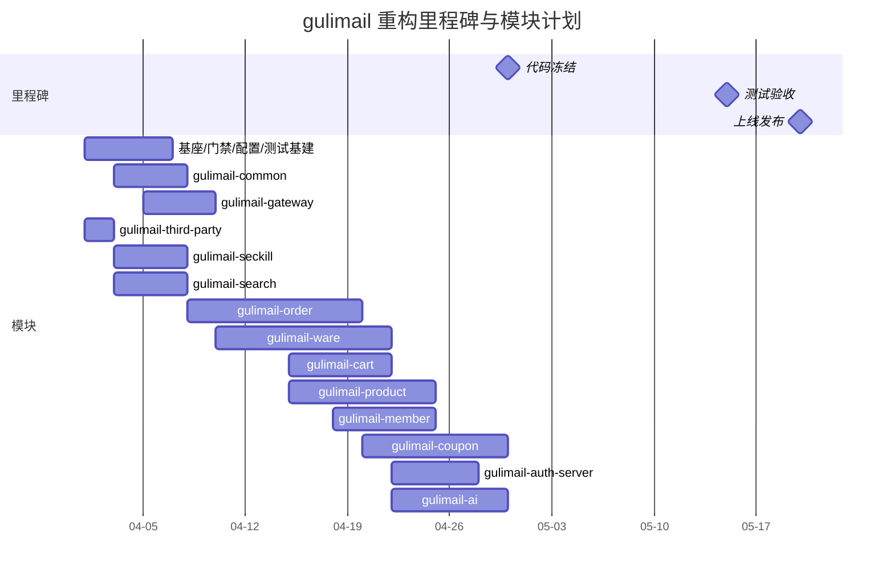

# 关键里程碑甘特图

- 本文件为手工维护，用于展示关键里程碑与模块计划窗口。

```mermaid
gantt
    title gulimail 重构里程碑与模块计划
    dateFormat  YYYY-MM-DD
    axisFormat  %m-%d

    section 里程碑
    代码冻结 : milestone, 2026-04-30, 0d
    测试验收 : milestone, 2026-05-15, 0d
    上线发布 : milestone, 2026-05-20, 0d

    section 模块
    基座/门禁/配置/测试基建 : 2026-04-01, 2026-04-07
    gulimail-common : 2026-04-03, 2026-04-08
    gulimail-gateway : 2026-04-05, 2026-04-10
    gulimail-third-party : 2026-04-01, 2026-04-03
    gulimail-seckill : 2026-04-03, 2026-04-08
    gulimail-search : 2026-04-03, 2026-04-08
    gulimail-order : 2026-04-08, 2026-04-20
    gulimail-ware : 2026-04-10, 2026-04-22
    gulimail-cart : 2026-04-15, 2026-04-22
    gulimail-product : 2026-04-15, 2026-04-25
    gulimail-member : 2026-04-18, 2026-04-25
    gulimail-coupon : 2026-04-20, 2026-04-30
    gulimail-auth-server : 2026-04-22, 2026-04-28
    gulimail-ai : 2026-04-22, 2026-04-30
```
