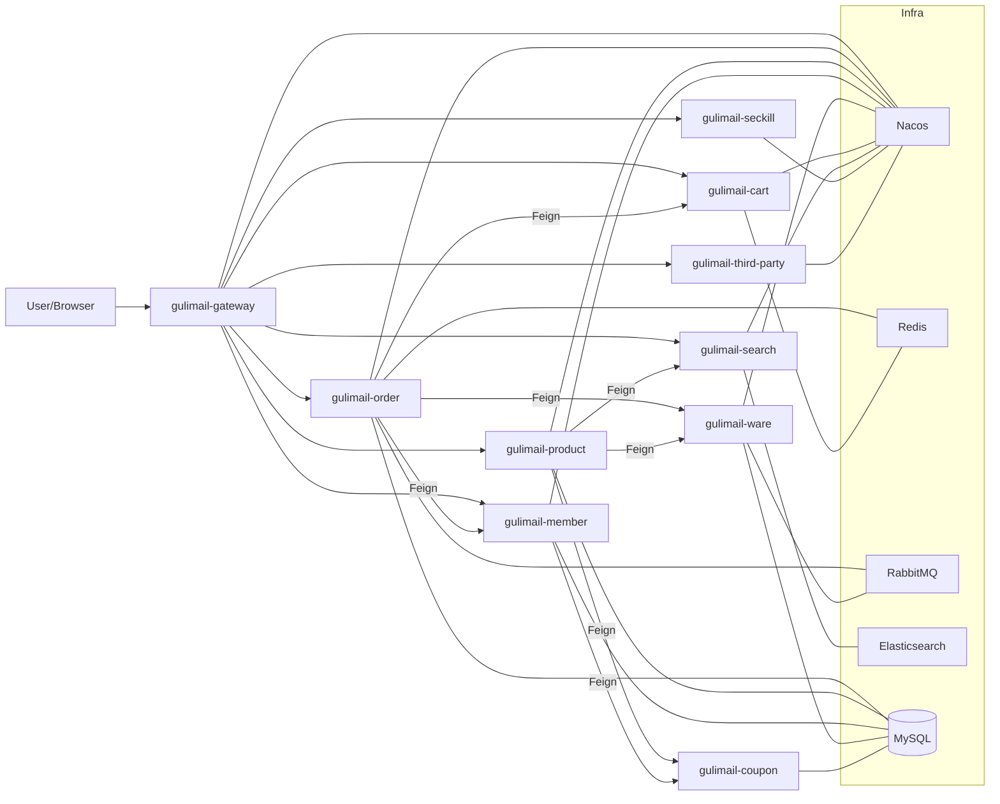
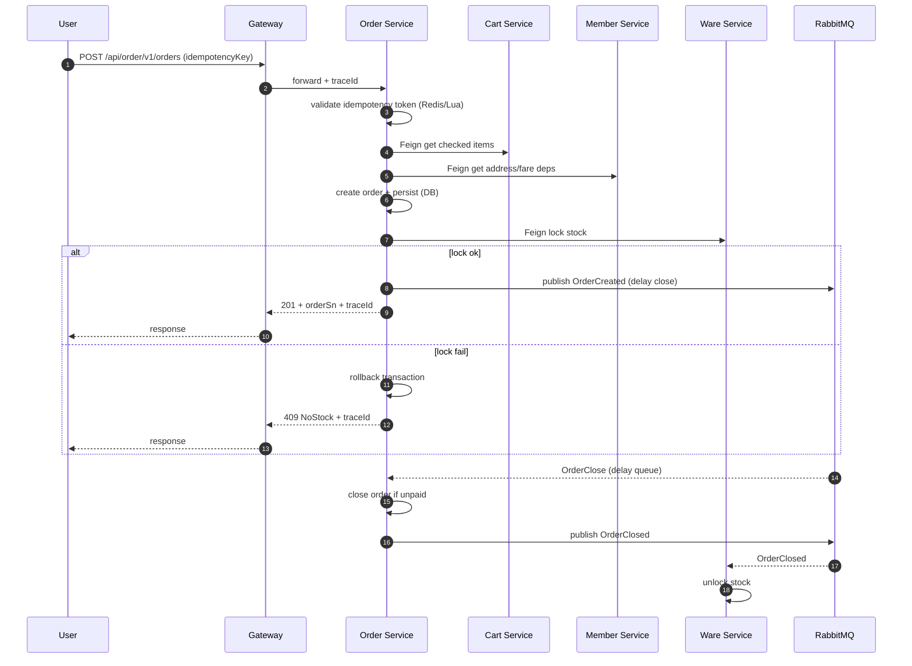
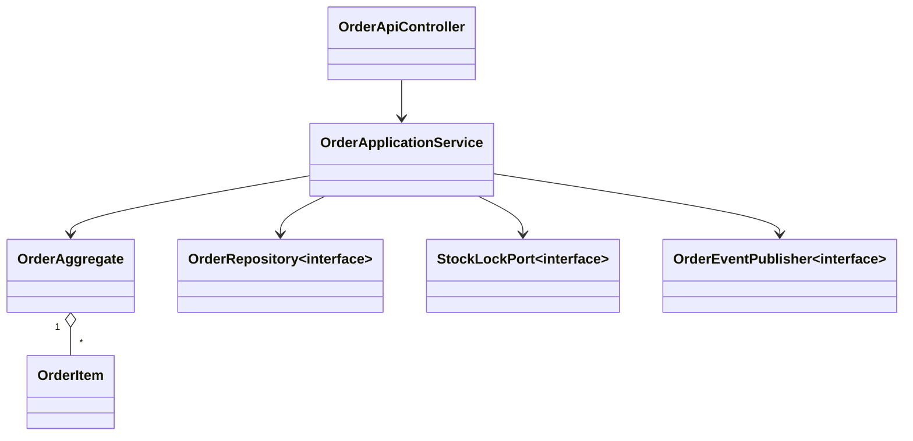

# gulimail 重构设计方案（Java 开发规范版）

本文档基于现有基线产物（代码资产清单、配置映射表、质量基线报告、技术债矩阵）形成可落地的重构设计方案，目标是：在不破坏既有业务契约的前提下，逐步实现 DDD 分层、质量门禁、可测试、可观测与可演练。

关联基线文档：
- 代码资产清单：[code-asset-inventory.md](file:///d:/GitProgram/gulimail/docs/refactor/code-asset-inventory.md)
- 配置映射表：[config-mapping.md](file:///d:/GitProgram/gulimail/docs/refactor/config-mapping.md)
- 质量基线报告：[quality-baseline.md](file:///d:/GitProgram/gulimail/docs/refactor/quality-baseline.md)
- 技术债矩阵与风险登记：[tech-debt-and-risks.md](file:///d:/GitProgram/gulimail/docs/refactor/tech-debt-and-risks.md)
- Java 开发规范（java-dev）：[java-style.md](file:///d:/GitProgram/gulimail/java-dev/references/java-style.md)

## 1. 当前架构分析与核心重构对象

### 1.1 模块与依赖结构（Maven 多模块）

- 根聚合为 Maven reactor，业务模块对 `gulimail-common` 呈星型依赖，当前无模块级循环依赖：[pom.xml](file:///d:/GitProgram/gulimail/pom.xml#L12-L35)
- 风险点：`gulimail-common` 容易演化为“万能依赖”，后续引入领域分层后应拆分为更细粒度的共享内核与 starter，避免跨域耦合扩散。

### 1.2 运行时架构（现状）

微服务形态（服务注册/配置中心、Feign、MQ、缓存、搜索）已具备，但存在“配置加载不一致、测试不可移植、依赖适配缺失”等基础设施问题，导致 CI/门禁无法稳定落地。

### 1.3 核心业务链路现状（用于确定“核心模块优先级”）

- 完整闭环（优先重构）：
  - 下单：OrderWebController → OrderServiceImpl.submitOrder：[tech-debt-and-risks.md](file:///d:/GitProgram/gulimail/docs/refactor/tech-debt-and-risks.md#L28-L45)
  - 库存锁定/解锁/扣减：WareSkuController/WareSkuServiceImpl + MQ Listener：[tech-debt-and-risks.md](file:///d:/GitProgram/gulimail/docs/refactor/tech-debt-and-risks.md#L37-L45)
- 范围缺口（必须先定策略）：
  - “优惠券核销/积分变更”未接入订单主链路（目前仅存在 CRUD/示例/字段预留）：[tech-debt-and-risks.md](file:///d:/GitProgram/gulimail/docs/refactor/tech-debt-and-risks.md#L47-L50)

### 1.4 需要优先治理的核心模块/组件（P0）

结合质量基线与风险登记，P0 先解“能跑、能测、能门禁”的阻塞：

- 配置治理（所有服务）：bootstrap/application 混用、namespace 缺失、敏感配置治理：[config-mapping.md](file:///d:/GitProgram/gulimail/docs/refactor/config-mapping.md)
- 测试可移植性：third-party/search/seckill 当前阻塞 root `mvn test`：[quality-baseline.md](file:///d:/GitProgram/gulimail/docs/refactor/quality-baseline.md#L18-L33)
- 秒杀模块 Sentinel 适配缺失：导致上下文无法启动：[quality-baseline.md](file:///d:/GitProgram/gulimail/docs/refactor/quality-baseline.md#L49-L53)
- 统一异常与响应模型（gulimail-common）：降低 controller try/catch 与返回不一致风险（见第 3 节）

## 2. To-Be 架构设计（DDD 分层 + 可演进落地）

### 2.1 分层目标（单服务内）

每个业务服务按包分层（阶段 1/2 可先包分层，阶段 3 视需要再拆 Maven 子模块）：

- `api`：Controller、DTO（入参/出参）、契约定义、请求校验
- `application`：用例编排（事务边界、幂等、调用聚合、发布领域事件）
- `domain`：聚合根/实体/值对象/领域服务/领域事件（不依赖 Spring/MyBatis/Feign）
- `infrastructure`：Repository 实现、MyBatis Mapper、Feign Client、MQ、Redis、ES、第三方 SDK、配置适配

约束规则（建议阶段 0 引入 ArchUnit 或等效手段固化）：
- `domain` 不能依赖 `infrastructure` 与 `api`
- `application` 仅依赖 `domain` 与抽象端口（接口），通过 Spring 注入基础设施实现
- `api` 只能调用 `application`（不直接调用 Mapper/Feign/Redis）

### 2.2 “跨服务调用”与“领域事件”设计

现状跨服务调用主要通过 Feign 与 MQ：
- 同步调用（Feign）：用于读模型聚合（如确认页地址/购物车）与必要的强一致操作（如锁库存接口）
- 异步事件（RabbitMQ）：用于“延迟关单、库存解锁/扣减”等最终一致场景

重构建议：
- 将 MQ 消费者（Listener）视为应用层入口：Listener 只做消息反序列化/幂等校验/调用 Application Service，不承载业务细节
- 对关键事件定义标准 envelope（建议字段：`eventId`、`eventType`、`occurredAt`、`traceId`、`payload`），用于幂等与可观测

### 2.3 幂等与一致性（下单/库存关键点）

现状采用 Redis token + Lua 防重；库存锁定/扣减通过 MQ 链路闭环。

重构增强点（兼容演进）：
- 幂等：对外接口幂等（下单提交、库存扣减消息）统一采用 `idempotencyKey`（Header 或字段）并在应用层统一校验
- 可靠消息：为关键 MQ 发送引入“本地事务 + Outbox”或“发送确认 + 重试表”机制，避免 DB 事务提交成功但消息丢失

建议新增表（阶段 1/2 引入 Flyway，低风险可回滚）：
- `message_outbox`：`id`、`event_type`、`aggregate_id`、`payload`、`status`、`retry_count`、`next_retry_at`、`created_at`、`updated_at`

## 3. API/异常/响应标准化设计（java-dev 规约落地）

### 3.1 现状问题摘要

- 大量 Renren 风格 CRUD：`/list /info/{id} /save /update /delete`，HTTP method 语义不一致（多用 `@RequestMapping` 不限方法）
- JSON API 与页面 Controller 并存，响应封装不统一（`R`、直接返回对象、SSE）
- 存在错误返回不明确（例如未登录直接返回 `null`）
- 全局异常处理存在但覆盖不足，部分场景 `void` 静默返回

证据与样例见接口扫描结论（Controller 扫描结果）：[GulimailExceptionControllerAdvice.java](file:///d:/GitProgram/gulimail/gulimail-common/src/main/java/com/lg/common/exception/GulimailExceptionControllerAdvice.java)

### 3.2 API 规范（兼容期 + 标准期）

兼容期（阶段 2）：
- 不强制重写所有路径，先统一“错误模型 + HTTP 状态码 + traceId”，允许 `R` 继续存在
- 对外 JSON API 建议统一前缀：`/api/{domain}/v1/**`（旧路径保留但标记为兼容）

标准期（阶段 2/3）：
- 路径与方法：
  - `GET /resources`、`GET /resources/{id}`、`POST /resources`、`PUT/PATCH /resources/{id}`、`DELETE /resources/{id}`
  - 动作型接口尽量名词化：如 `POST /seckill/orders`，`POST /sms/verification-codes:verify`
- 响应格式：
  - 成功：`ApiResponse<T>{ data, traceId, meta? }`
  - 失败：`ApiError{ code, message, details?, path, timestamp, traceId }`

### 3.3 异常处理机制（统一与减少重复）

改造原则（java-dev）：
- 不在 controller “吞异常”或“返回 null”，统一抛出业务异常/鉴权异常
- controller 不写 try/catch 兜底（除非做显式的降级/补偿），统一由 `@RestControllerAdvice` 处理

改造点（目标文件）：
- 统一增强 [GulimailExceptionControllerAdvice.java](file:///d:/GitProgram/gulimail/gulimail-common/src/main/java/com/lg/common/exception/GulimailExceptionControllerAdvice.java)
  - 增加业务异常专用 handler（库存不足、参数错误、未登录、权限不足、资源不存在、并发冲突）
  - 返回体统一带 `traceId`，日志统一输出 `traceId`（第 4.4 节）

## 4. 代码改造清单（按模块/组件，含联动关系）

本节给出可直接用于任务分解与评审的“改造清单”。改造以“对外契约不变、内部重写”为默认策略；涉及签名变化会显式标注并列出联动模块。

### 4.1 gulimail-common（共享能力：P0）

| 文件/类 | 改造内容 | 影响范围/联动 |
| --- | --- | --- |
| [R.java](file:///d:/GitProgram/gulimail/gulimail-common/src/main/java/com/lg/common/utils/R.java) | 保留兼容；新增 `traceId` 字段写入能力；统一成功/失败构建入口 | 所有 JSON API |
| [BizCodeEnum.java](file:///d:/GitProgram/gulimail/gulimail-common/src/main/java/com/lg/common/exception/BizCodeEnum.java) | 补齐业务码：401/403/404/409/429 等；避免硬编码错误码 | 全局异常与业务异常 |
| [GulimailExceptionControllerAdvice.java](file:///d:/GitProgram/gulimail/gulimail-common/src/main/java/com/lg/common/exception/GulimailExceptionControllerAdvice.java) | 统一异常映射与 HTTP 状态码（兼容期可先返回 `R`，但用 `ResponseEntity`） | 所有服务的 controller |
| `com.lg.common.web`（新增） | 新增 `ApiResponse<T>`、`ApiError`（标准期）；新增 `TraceIdFilter`/`TraceIdInterceptor` | 网关与各服务 |

必须同步修改的关联模块：
- 所有 `*Controller`：删除局部 try/catch 兜底与返回 `null` 的写法，改为抛出标准异常
- 网关与服务日志配置：确保 traceId 可透传与打印（第 4.4 节）

### 4.2 gulimail-order（订单域：核心链路 P0/P1）

核心重构目标：将 “下单用例” 从 `service.impl` 的巨方法拆分为应用层用例编排 + 领域模型校验 + 基础设施适配，强化事务边界与幂等。

| 文件/类 | 改造内容 | 联动模块 |
| --- | --- | --- |
| [OrderWebController.java](file:///d:/GitProgram/gulimail/gulimail-order/src/main/java/com/lg/gulimail/order/web/OrderWebController.java) | Web MVC 与 JSON API 解耦：保留页面控制器；新增 `api` controller 承载 JSON；统一异常处理（不吞异常） | 网关路由、前端调用方 |
| `order/api`（新增包） | 新增 `OrderApiController`（示例：`POST /api/order/v1/orders`）、DTO（请求/响应） | gulimail-common 响应/异常 |
| [OrderServiceImpl.java](file:///d:/GitProgram/gulimail/gulimail-order/src/main/java/com/lg/gulimail/order/service/impl/OrderServiceImpl.java) | 拆分：`OrderApplicationService.submitOrder()` 用例编排；领域对象（OrderAggregate）负责规则；Repository/Feign/MQ 下沉到 infrastructure | ware/cart/member、MQ |
| `order/domain`（新增包） | 引入 `OrderAggregate`、`OrderItem`、`OrderPrice`、`OrderStatus`、`OrderDomainService` | DB 映射与 DO/Entity 转换 |
| `order/infrastructure`（新增包） | 适配：`OrderRepository`（DB）、`WmsClient`（Feign）、`OrderEventPublisher`（MQ/Outbox） | gulimail-ware、RabbitMQ |
| [OrderReleaseListener.java](file:///d:/GitProgram/gulimail/gulimail-order/src/main/java/com/lg/gulimail/order/listener/OrderReleaseListener.java) 等监听器 | Listener 只做反序列化 + 幂等校验 + 调用 Application Service；禁止包含业务细节 | ware listener、MQ 配置 |
| [MyRabbitConfig.java](file:///d:/GitProgram/gulimail/gulimail-order/src/main/java/com/lg/gulimail/order/config/MyRabbitConfig.java) / [MyMQConfig.java](file:///d:/GitProgram/gulimail/gulimail-order/src/main/java/com/lg/gulimail/order/config/MyMQConfig.java) | 队列/路由键统一命名规范；消息体 envelope 化；必要时接入发布确认与重试 | gulimail-ware 对应绑定 |

建议的签名/依赖调整（兼容期可通过适配器保留旧签名）：
- controller → application：引入显式 request/response DTO（避免直接暴露 entity/VO）
- application → infrastructure：依赖接口（`OrderRepository`、`StockLockPort`、`PaymentPort`），通过 Spring 注入实现

### 4.3 gulimail-ware（库存域：核心链路 P0/P1）

核心重构目标：锁库存/解锁/扣减三段式行为收敛到应用层；底层 SQL 保留但统一走 Repository；引入幂等与一致性策略。

| 文件/类 | 改造内容 | 联动模块 |
| --- | --- | --- |
| [WareSkuController.java](file:///d:/GitProgram/gulimail/gulimail-ware/src/main/java/com/lg/gulimail/ware/controller/WareSkuController.java) | 新增 `api` controller；旧 controller 保留兼容；统一异常处理 | order Feign 调用方 |
| [WareSkuServiceImpl.java](file:///d:/GitProgram/gulimail/gulimail-ware/src/main/java/com/lg/gulimail/ware/service/impl/WareSkuServiceImpl.java) | 拆分为 `WareApplicationService` + `StockDomainService`；锁库/扣减逻辑内聚；避免跨层直接操作 Mapper | MyBatis Mapper/XML |
| [StockDeductListener.java](file:///d:/GitProgram/gulimail/gulimail-ware/src/main/java/com/lg/gulimail/ware/listener/StockDeductListener.java) / [StockReleaseListener.java](file:///d:/GitProgram/gulimail/gulimail-ware/src/main/java/com/lg/gulimail/ware/listener/StockReleaseListener.java) | Listener 简化为应用层入口；增加幂等（eventId 或 orderSn） | order 发消息方 |
| [WareSkuDao.xml](file:///d:/GitProgram/gulimail/gulimail-ware/src/main/resources/mapper/ware/WareSkuDao.xml) | SQL 分级治理：关键 SQL 增加 explain 基线与索引建议；必要时引入乐观锁/条件更新 | DB 索引与表结构 |

数据库变更建议（如启用 Outbox/幂等表）：
- `stock_work_task_detail`（若已有）：补齐唯一约束（`order_sn + sku_id`）用于幂等防重
- 新增 `message_outbox`（见第 2.3）

### 4.4 gulimail-gateway（网关：接口统一与安全 P1）

目标：统一鉴权、traceId 透传、限流/熔断与规则治理。

| 文件/类 | 改造内容 | 联动模块 |
| --- | --- | --- |
| [GulimailGatewayApplication.java](file:///d:/GitProgram/gulimail/gulimail-gateway/src/main/java/com/lg/gulimail/gateway/GulimailGatewayApplication.java) | 统一扫描与配置加载策略；补齐 Nacos namespace 配置缺失 | Nacos 配置治理 |
| [GuliMailCorsConfiguration.java](file:///d:/GitProgram/gulimail/gulimail-gateway/src/main/java/com/lg/gulimail/gateway/config/GuliMailCorsConfiguration.java) | CORS 白名单化、按环境治理 | 配置中心 |
| `gateway/filter`（新增包） | TraceIdFilter、AuthFilter、ReplayProtectFilter（防重放） | 各服务鉴权上下文 |
| [SentinelGatewayConfig.java](file:///d:/GitProgram/gulimail/gulimail-gateway/src/main/java/com/lg/gulimail/gateway/config/SentinelGatewayConfig.java) | Sentinel 规则持久化到 Nacos；与 seckill Sentinel 适配修复联动 | gulimail-seckill |

### 4.5 gulimail-search（搜索：测试稳定性与接口标准化 P0/P1）

| 文件/类 | 改造内容 | 联动模块 |
| --- | --- | --- |
| [ElasticSaveController.java](file:///d:/GitProgram/gulimail/gulimail-search/src/main/java/com/lg/gulimail/search/controller/ElasticSaveController.java) | controller 不捕获兜底异常；改由全局异常处理；路径 RESTful 化（标准期） | product Feign 调用方 |
| [GulimailSearchApplicationTests.java](file:///d:/GitProgram/gulimail/gulimail-search/src/test/java/com/lg/gulimail/search/GulimailSearchApplicationTests.java) | 用 Testcontainers 启动 ES，并在测试前创建索引与数据；消除对 `bank` 索引的硬依赖 | CI 稳定性 |

### 4.6 gulimail-seckill（秒杀：依赖适配修复 P0）

| 文件/类 | 改造内容 | 联动模块 |
| --- | --- | --- |
| `SeckillSentinelConfig`（当前阻塞点） | 修复 Sentinel WebMVC 适配依赖缺失/版本不匹配，确保上下文可启动 | gateway Sentinel |
| [SeckillSkeduler.java](file:///d:/GitProgram/gulimail/gulimail-seckill/src/main/java/com/lg/gulimail/seckill/scheduled/SeckillSkeduler.java) | 任务幂等（避免重复上架/重复扫描）；执行耗时打点 | 监控指标 |

### 4.7 gulimail-third-party（第三方：配置与密钥治理 P0）

| 文件/类 | 改造内容 | 联动模块 |
| --- | --- | --- |
| [OssConfig.java](file:///d:/GitProgram/gulimail/gulimail-third-party/src/main/java/com/lg/gulimail/thirdparty/config/OssConfig.java) | 将必需配置改为“可选注入 + 启动时明确失败原因”；测试 profile 下 mock/stub | 测试基线 |
| [GulimailThirdPartyApplicationTests.java](file:///d:/GitProgram/gulimail/gulimail-third-party/src/test/java/com/lg/gulimail/thirdparty/GulimailThirdPartyApplicationTests.java) | 不依赖真实密钥；引入 stub 或禁用对外调用；保证 `mvn test` 可运行 | CI 绿灯 |

## 5. 明确重构目标（可量化）

### 5.1 可维护性（SOLID）

- SRP：用例编排（application）与领域规则（domain）与适配器（infrastructure）职责分离；Listener/Controller 不承载业务细节
- OCP：跨域能力（响应/异常/日志/鉴权）通过 starter/抽象端口扩展，不通过复制粘贴扩散
- LSP/ISP：Feign/Repository/MQ 端口按用例拆分，避免“万能接口”
- DIP：domain 不依赖 Spring/MyBatis/Feign；application 依赖抽象端口

### 5.2 性能指标（作为阶段验收口径）

以核心链路为指标对象（P95/P99、吞吐、错误率）：
- 下单提交（Order.submit）：P95 降低 ≥ 30%，错误率 ≤ 0.1%
- 锁库存（Ware.lockStock）：P95 降低 ≥ 30%，并发 200 时超时率 ≤ 0.5%
- MQ 消费（关单/解锁/扣减）：端到端延迟（消息产生→业务完成）P95 降低 ≥ 30%

说明：当前仓库尚未固化压测脚本与性能基线，需在“第三阶段：性能验证”统一落数（见第 6.3）。

### 5.3 单元测试覆盖率

- 覆盖率目标：≥ 80%（以 JaCoCo 报告为准）
- 口径建议：
  - 重点覆盖 `domain` 与 `application`
  - DTO/配置类/纯 getter-setter 可在规则上适度排除，但需统一口径并在门禁中固化
- 前置条件：测试必须可重复、不可依赖固定 IP 的外部基础设施（Testcontainers 或 stub）

### 5.4 日志追踪与监控

- TraceId：
  - 网关生成 `traceId`（若上游无）并透传到各服务（header + MDC）
  - 业务日志必须包含 `traceId`，并在异常处理返回体中回传 `traceId`
- 指标与健康检查：
  - Micrometer + Prometheus + Grafana：QPS、RT、ErrorRate、JVM、线程池、DB 连接池、MQ 消费滞后
  - Actuator readiness/liveness

## 6. 分阶段实施计划（三阶段版）

三阶段计划与现有 0~6 分期一一映射（便于保持原节奏不变，同时满足“实施三阶段”管理口径）。

### 6.1 第一阶段：核心模块重构（优先级明确）

优先级（从高到低）：
1) P0 基础阻塞清零：配置治理 + 测试可移植（third-party/search/seckill）+[quality-baseline.md](file:///d:/GitProgram/gulimail/docs/refactor/quality-baseline.md)
2) 订单/库存主链路分层落地（application/domain/infrastructure）+[tech-debt-and-risks.md](file:///d:/GitProgram/gulimail/docs/refactor/tech-debt-and-risks.md#L28-L45)
3) 可靠消息/幂等统一（Outbox 或重试表）

对应原计划阶段：0、1、3（样板域）、4（订单/库存优先）。

### 6.2 第二阶段：接口标准化改造

目标：
- 新增 `/api/{domain}/v1` 风格入口（不立刻删除旧接口）
- 统一错误模型、HTTP 状态码语义、鉴权失败与参数校验错误
- 网关统一鉴权、JWT 刷新、防重放、限流规则持久化

对应原计划阶段：2、5。

### 6.3 第三阶段：集成测试与性能验证

目标：
- 建立可重复的集成测试基座（Testcontainers：MySQL/Nacos/RabbitMQ/ES）
- 建立接口测试与压测基线（脚本纳入仓库并由 CI 触发）
- 输出性能对比报告与链路热点耗时图（Arthas/日志 tracing）

对应原计划阶段：6（观测与运维）+ 贯穿各阶段的测试/性能验收。

## 7. 代码审查标准（java-dev + 安全 + 架构约束）

### 7.1 命名与结构

- 包/类/方法命名遵循 [java-style.md](file:///d:/GitProgram/gulimail/java-dev/references/java-style.md#L42-L107)
- 分层结构明确：controller 不调用 mapper/redis/feign；listener 不写业务；domain 不依赖 spring

### 7.2 设计模式与可测试性

- 应用层：用例编排（Facade/ApplicationService），事务边界清晰
- 领域层：聚合根封装不变量；使用值对象表示金额/数量/状态
- 基础设施：Repository/Client 通过接口隔离，便于 mock

### 7.3 日志、异常与安全

- 日志：
  - 不记录敏感信息（AK/SK/Token/验证码/个人信息）
  - 必须携带 `traceId`
- 异常：
  - 业务异常使用统一枚举码，不允许硬编码 magic number
  - 参数错误必须返回可定位的字段级错误
- 安全：
  - 入参校验（JSR-303），防止越权与水平权限问题
  - 幂等与防重放：关键写接口具备幂等策略

### 7.4 质量门禁（MR 必须提供的证据）

- 通过：单元测试、覆盖率、静态扫描（checkstyle/PMD/SpotBugs）、基础安全扫描（如依赖漏洞）
- 提供：变更影响范围、回滚方案、性能对比（若涉及核心链路）

可直接使用模板：
- MR 模板：[mr-template.md](file:///d:/GitProgram/gulimail/docs/refactor/templates/mr-template.md)
- 评审纪要模板：[review-minutes-template.md](file:///d:/GitProgram/gulimail/docs/refactor/templates/review-minutes-template.md)

## 8. 设计图（时序图、类图）

### 8.1 下单 + 锁库存 + 关单/解锁（时序图）

### 8.2 订单域核心类图（示意）

